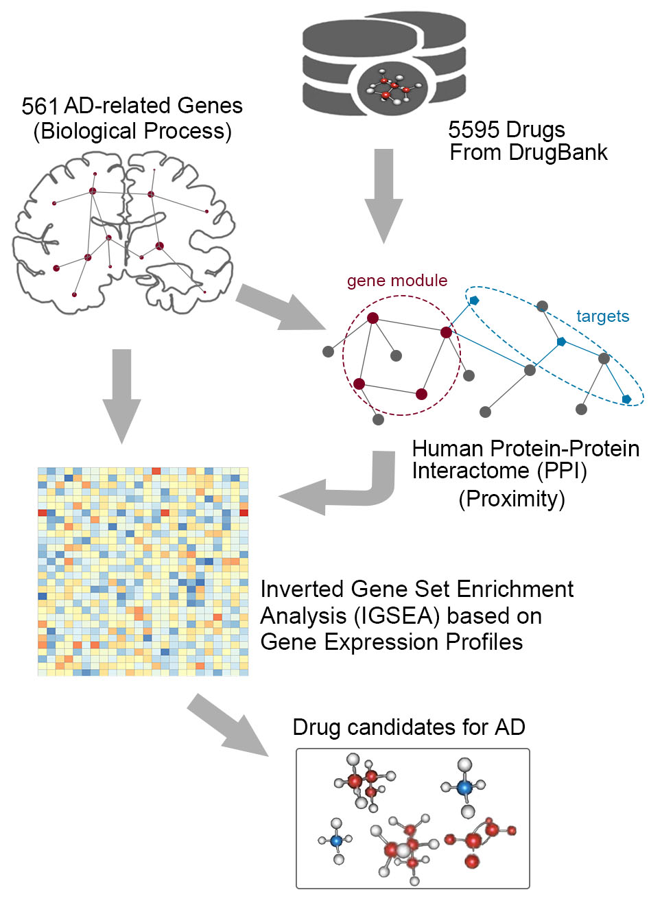

# drug-repo

The framework of computational drug repositioning is an integration of molecular network-based approach and pharmacoepidemiologic method, witch includes the following steps (shown as figure):

1. collection of disease-related genes;
2. collection of available drugs;
3. screening drugs by their proximity to disease-related genes on the interactome network;
4. filtering the screened drugs based on their correlation with gene expression profiles.

   

Relevant [paper]() has been published in Bioinformatics.
